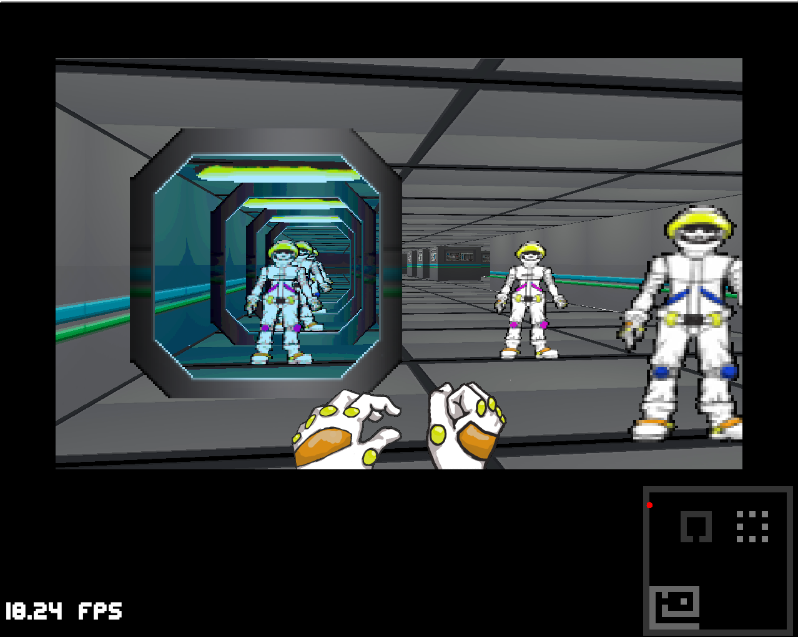

# mc-wolf3d
Little raycasting game engine.

    $ cd quicklisp/local-projects/
    $ git clone https://github.com/josrr/mc-wolf3d.git
    $ sbcl
    This is SBCL 1.4.6, an implementation of ANSI Common Lisp.
    More information about SBCL is available at <http://www.sbcl.org/>.

    SBCL is free software, provided as is, with absolutely no warranty.
    It is mostly in the public domain; some portions are provided under
    BSD-style licenses.  See the CREDITS and COPYING files in the
    distribution for more information.
    * (ql:quickload "mc-wolf3d")
    To load "mc-wolf3d":
      Load 1 ASDF system:
        mc-wolf3d
    ; Loading "mc-wolf3d"
    ..................................................
    [package escenario]...............................
    [package mc-wolf3d]........
    ("mc-wolf3d")
    * (mc-wolf3d:wolf3d-main escenario:*mapa*)

Press the n key to start the game

### Code by José Miguel Ronquillo Rivera <jose@rufina.link>
### Art by Alexis Ruiz Martínez

## License
Copyright © 2018 [José Miguel Ronquillo Rivera](mailto:<jose@rufina.link>)

GNU General Public License version 3.

